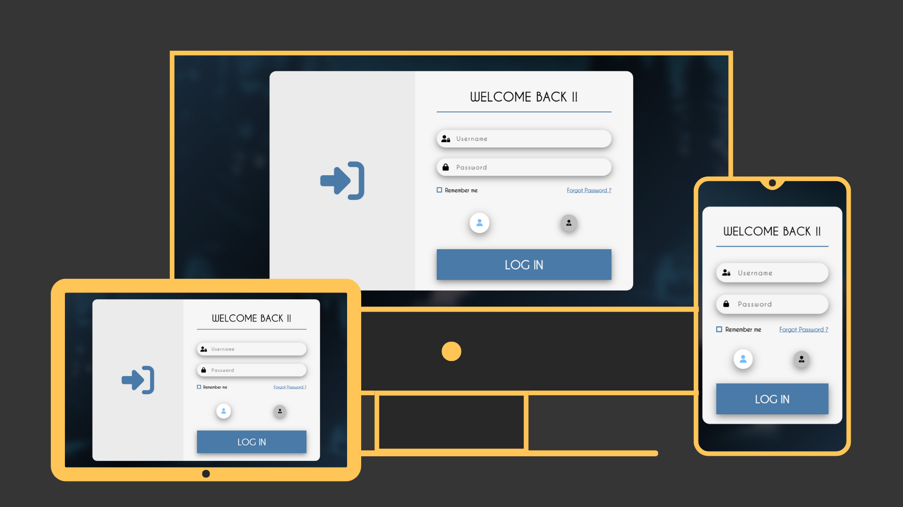

# 🔐 Login Form

A sleek and animated login form built with HTML, CSS, and JavaScript. Includes user/admin role selection, smooth UI animations, and a responsive design.

## 🌟 Features

- 🎨 Elegant and modern UI with smooth color blending  
- 🚀 Cool entry animation on load  
- 👤 Role selection: User or Admin  
- 📱 Fully responsive layout  
- 🧼 Clean, minimal structure using HTML, CSS, and Vanilla JS

## 💻 Tech Stack

- HTML  
- CSS  
- Vanilla JavaScript  

## 🚀 Live Demo

Try it here 👇  
https://zeddy-foreal.github.io/login-form

## 📸 Preview



## 📁 How to Run Locally

```bash
git clone https://github.com/zeddy-foreal/login-form.git
cd login-form
# Then open index.html in your browser

